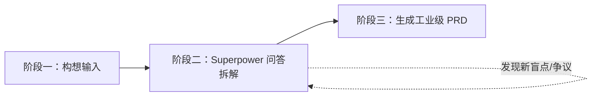

# 产品经理 Superpower 需求拆解与 PRD 输出工作流

本技能专为**产品经理（PM）**设计，提供一套从**“模糊构想”**到**“严谨 PRD”**的标准化引导与生产工作流。遵循 Superpower 方法论的核心原则：**严禁在需求模糊时过早推进方案，坚持以问答和推演驱动需求收敛**。

---

## 🎯 整体流程概述

整个工作流分为三个标准阶段：

1. **阶段一：意图捕获与范围界定 (Ingestion)**：接收产品经理的初步构想，提取核心关键词，确定业务领域。
2. **阶段二：Superpower 启发式问答拆解 (Socratic Deconstruction)**：分阶段、有节奏地向产品经理发起结构化提问，深挖目标、场景、规则、边界与权衡。
3. **阶段三：规范化 PRD 文档产出 (PRD Formulation)**：汇总共识，生成逻辑严密、研发可直接落地的完整产品需求文档。

---

## 📌 阶段一：构想输入与初始对齐 (Ingestion)

当产品经理表达需求时（例如：“*我想做一个面向电商卖家的自动化退款审批插件*”）：

1. **倾听并确认基础信息**：
   - 提取产品名称/暂定代号。
   - 初步归类产品形态（Web端 / App / 插件 / 后台系统 / API / 智能体等）。
   - 提炼核心痛点假设。
2. **设定工作流预期**：
   - 告知产品经理：“我们将通过 Superpower 结构化提问方法拆解该需求，预计分 3 轮聚焦探讨，确保研发与业务边界清晰无漏洞，随后为您生成完整 PRD。”

---

## 🔍 阶段二：Superpower 启发式问答拆解 (Socratic Deconstruction)

### 核心原则
- **避免一次性问题轰炸**：每次提问控制在 2~3 个核心问题，按逻辑层次层层递进。
- **提供推荐选项或参考答案**：减轻产品经理的输入心智负担，不仅问“你想要怎样”，更给出“业界常见做法是 A 还是 B”。
- **苏格拉底式追问与挑战**：主动挑战伪需求、不合理的边界假设及可能的利益冲突点。

### 三轮拆解框架

#### 第 1 轮：核心价值与目标边界 (Why & Who & Non-Goals)
*聚焦业务目标、用户人群、以及明确不做的事情。*
- **Q1.1 用户画像与真实痛点**：核心使用者是谁？他们当前通过什么方式满足该需求？最难受的痛点是什么？
- **Q1.2 商业/业务目标与衡量指标**：该产品或功能上线的成功指标（KPI / 北极星指标）是什么？（如提高效率 X%、降低客诉率 Y% 等）。
- **Q1.3 边界与非目标 (Non-Goals)**：为了保证 MVP（最小可行性版本）快速落地，**本次绝对不做**什么？哪些是后续迭代才考虑的？

#### 第 2 轮：核心场景与用户动线闭环 (Where & When & User Journey)
*聚焦典型场景中的端到端流程与分支。*
- **Q2.1 典型业务主场景**：请描述一个最标准、最核心的用户使用全流程（起点、动作、终点）。
- **Q2.2 核心实体与状态机**：该流程涉及哪些核心业务对象？它们的状态如何流转？（如：草稿 -> 待审批 -> 已通过 -> 已驳回 -> 已作废）。
- **Q2.3 关键交互与角色权限**：涉及哪些不同角色（普通用户、管理员、审核员等）？各角色的操作权限与视窗边界如何划分？

#### 第 3 轮：业务规则、边界与异常分支 (How & Edge Cases & Trade-offs)
*深挖技术/业务细节，消除漏洞与研发返工隐患。*
- **Q3.1 关键业务规则与计算逻辑**：核心判定条件、校验规则、自动化触发机制是什么？
- **Q3.2 异常与极端情况 (Edge Cases)**：
  - 弱网/中断/重复提交/超时如何处理？
  - 并发冲突或脏数据如何防范？
  - 逆向流程（取消、撤回、退款、修改已生效数据）的规则是什么？
- **Q3.3 外部依赖与上下游系统**：依赖哪些外部 API、老系统旧数据或第三方服务？若外部依赖不可用时，系统如何降级？

> 💡 **技巧**：在每一轮提问中，若用户回答较为模糊，主动进行归纳，并使用“我的理解是……如果是这样，我们建议采用方案 A，您看是否符合预期？”来进行收敛。

---

## 📄 阶段三：工业级 PRD 文档生成 (PRD Generation)

在三轮问答形成明确共识后，进入 PRD 输出阶段。

### 输出动作
1. **自动生成文件**：在项目的 `docs/prd/` 目录下生成独立的 Markdown 文件，文件命名为：`PRD-<功能/产品名称>-<YYYYMMDD>.md`。
2. **文档结构规范**（参考 [PRD 模板](./templates/prd-template.md)）：
   - **1. 文档基本信息**（名称、版本、作者、状态、更新日志）
   - **2. 需求背景与价值**（痛点背景、业务目标、成功衡量指标 OKR/KPI）
   - **3. 目标用户画像**（角色定义、核心诉求、使用频次）
   - **4. 需求边界与范围**（In-Scope MVP 范围 vs Out-of-Scope Non-Goals）
   - **5. 业务流程与架构**（业务流程图 Mermaid、状态机转换图、权限矩阵）
   - **6. 功能需求详细规格 (Feature Breakdown)**：
     - 每个模块按功能点编号（如 F-01, F-02）
     - 优先级标记（P0 - 核心必备 / P1 - 重要 / P2 - 锦上添花）
     - 包含：前置条件、输入要素、交互动线、业务处理规则、后置影响、异常/分支提示
   - **7. 非功能性需求**（性能、稳定性、安全性、合规要求、多端兼容性）
   - **8. 数据埋点与运营监控**（关键事件埋点表、核心指标看板诉求）
   - **9. 交付计划与里程碑**（阶段划分、MVP 发布计划、风险与应对方案）

3. **文档呈现**：
   - 将 PRD 保存至文件后，为产品经理展示文档核心结构摘要，并突出标注需要研发/设计团队重点关注的技术风险与决策点。
   - 询问产品经理是否需要微调或进入原型设计/研发任务拆解阶段。
