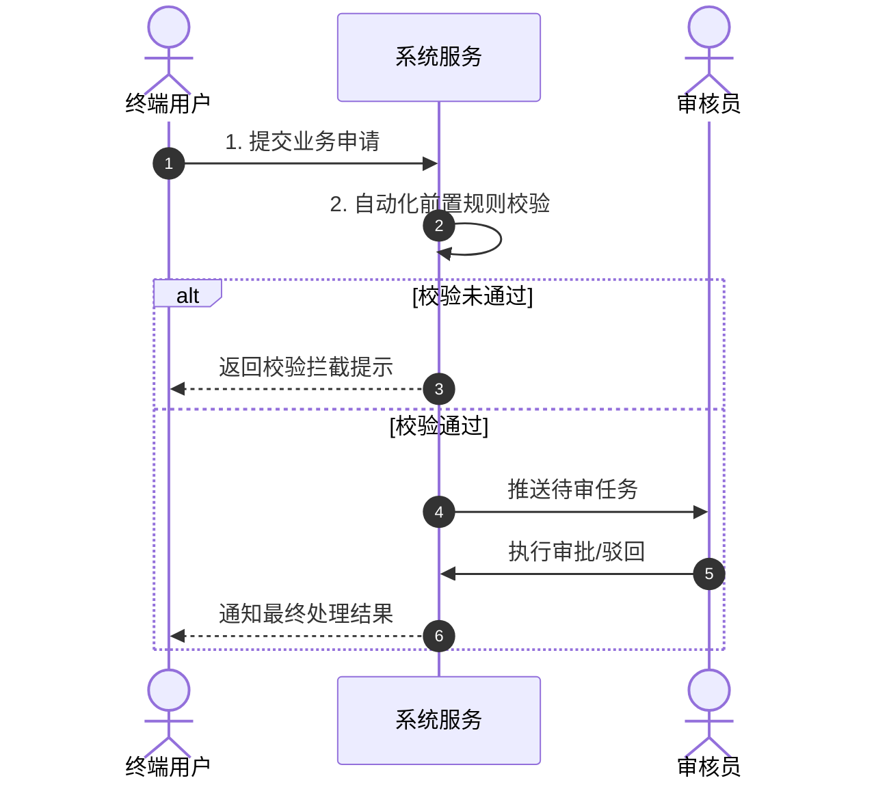
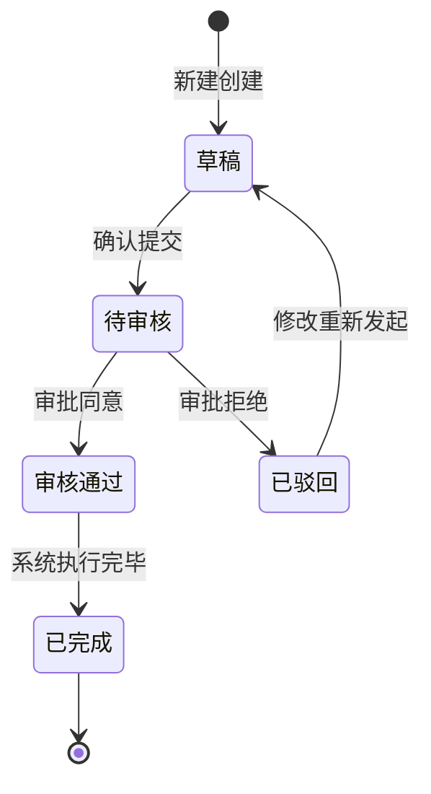

# 【产品需求文档】{{产品/功能名称}} (PRD)

| 文档版本 | 文档状态 | 编写人 | 创建日期 | 评审日期 |
| :--- | :--- | :--- | :--- | :--- |
| V1.0.0 | Draft / Review / Approved | {{PM 姓名}} | {{YYYY-MM-DD}} | {{待定}} |

---

## 1. 需求背景与业务价值

### 1.1 业务背景与问题痛点
- **现状背景**：简述当前业务现状及市场/业务环境。
- **核心痛点**：当前用户/业务遇到的主要瓶颈与痛点是什么？如果不解决会有什么后果？

### 1.2 业务目标与价值衡量 (Success Metrics)
- **核心目标**：本次迭代期望实现的定量或定性目标。
- **衡量指标 (KPI / North Star Metric)**：
  - 指标 1：例如，任务平均处理耗时由 15 分钟降低至 2 分钟。
  - 指标 2：例如，用户自主完成率提升至 85% 以上。

---

## 2. 用户角色与画像

| 角色名称 | 核心职责/定位 | 使用频次 | 核心诉求 | 关键权限 |
| :--- | :--- | :--- | :--- | :--- |
| 终端用户 | 业务发起方 | 高频 (每日) | 便捷提交、实时获知进度 | 仅可查看并编辑本人单据 |
| 审核员 | 流程把关方 | 中频 | 快速甄别风险、批量操作 | 审核、驳回、添加备注 |
| 系统管理员 | 规则配置与运维 | 低频 | 灵活配置规则、操作审计 | 全局配置、日志审计 |

---

## 3. 需求范围与边界界定

### 3.1 包含范围 (In-Scope / MVP)
- [ ] 核心功能 1：……
- [ ] 核心功能 2：……

### 3.2 不包含范围 (Out-of-Scope / Non-Goals)
> 明确本次迭代坚决不做的内容，防止范围蔓延：
- ❌ 暂不支持跨租户数据同步（延后至 V2.0）。
- ❌ 暂不提供复杂的自定义报表配置。

---

## 4. 业务架构与全局流程

### 4.1 核心业务主流程 (Mermaid 流程图)

### 4.2 核心业务状态机流转 (State Diagram)

---

## 5. 功能需求详细说明 (Feature Breakdown)

### 模块一：【模块名称】

#### 功能点 F-01：【功能点名称】（优先级：P0 / P1 / P2）

1. **功能概述**：
   - 简要描述该功能的作用与触发入口。
2. **前置条件**：
   - 用户已登录，且拥有对应角色权限。
3. **界面/交互说明**：
   - 页面布局入口与核心控件说明。
   - 按钮交互（正常、悬浮、禁用、加载状态）。
4. **业务处理逻辑与规则**：
   - 规则 1：输入项限制与合法性校验规则。
   - 规则 2：计算逻辑或联动变动规则。
   - 规则 3：持久化与通知触发机制。
5. **异常与分支情况 (Edge Cases)**：
   - **网络中断/超时**：保留已填写的本地临时草稿，弹出轻提示重试。
   - **并发操作**：采用乐观锁/分布式锁防重复点击与并发覆盖。
   - **越权访问**：统一拦截并返回 403 页面提示。
6. **后置影响**：
   - 数据变更记录至审计日志表；发送钉钉/企微消息通知。

---

## 6. 非功能性需求 (NFR)

1. **性能需求**：
   - 核心接口响应时间 P95 < 500ms，P99 < 1000ms。
   - 页面首次内容绘制 (FCP) < 1.5s。
2. **并发与高可用**：
   - 支持并发 TPS 峰值 500+，可用性达 99.9%。
3. **安全性与权限**：
   - 严格进行数据行级权限控制；敏感字段（手机号、身份证、金额）需前端脱敏、后端加密传输与存储。
4. **兼容性**：
   - 浏览器支持 Chrome 90+、Edge、Safari 最新两代版本。

---

## 7. 数据埋点与运营监控

| 埋点事件名称 | 事件标识 (Event ID) | 触发时机 | 携带参数 | 分析目的 |
| :--- | :--- | :--- | :--- | :--- |
| 点击提交申请 | `btn_submit_click` | 用户点击“提交”按钮时 | `user_id, source_page` | 漏斗转化率分析 |
| 申请提交成功 | `apply_submit_success` | 后端接口返回成功后 | `user_id, order_id, cost_time` | 计算端到端成功率 |

---

## 8. 实施计划与里程碑

| 阶段 | 周期 | 核心交付物 | 负责人 |
| :--- | :--- | :--- | :--- |
| Phase 1: 需求评审 | W1 | 研发/测试/设计各方对齐 PRD，签字确认 | PM |
| Phase 2: UI设计与架构设计 | W2 | 高保真交互原型、技术方案设计 (TRD) | UI / 架构师 |
| Phase 3: 研发与联调 | W3-W4 | 功能编码完成、接口联调完毕 | 前后端研发 |
| Phase 4: 测试与验收 | W5 | 冒烟测试、全量测试用例覆盖、PM 业务验收 | QA / PM |
| Phase 5: 灰度与上线 | W6 | 10% 灰度发布、全量发布、效果监控追踪 | PM / 运维 |

---

## 9. 风险识别与备选方案 (Contingency Plans)

| 潜在风险项 | 影响级别 | 应对与缓解策略 |
| :--- | :--- | :--- |
| 第三方 API 稳定性不确定 | 高 | 增加本地降级机制与异步重试队列，保障主流程不阻塞 |
| 业务方需求范围后期微调 | 中 | 严格锁定 MVP 范围，变更遵循标准变更流程，非核心移至迭代二 |
