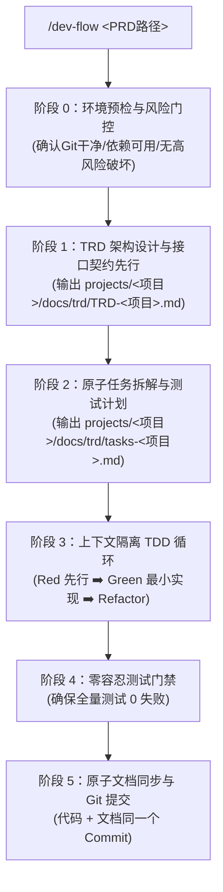

# /dev-flow: 根据 PRD 自动化驱动端到端开发工作流

基于指定的 PRD 文档，全自动执行从技术方案设计 (TRD) 到 TDD 编码实现的完整工程闭环。

**语法**：
`/dev-flow <PRD文件路径或项目名称>`

**示例**：
- `/dev-flow projects/AgentRelay/docs/prd/PRD-AgentRelay-远程AI任务伴侣.md`
- `/dev-flow AgentRelay`

---

## 执行编排流水线 (全程自动串联推进)

---

## 阶段具体动作与产出

### 阶段 0：环境预检与风险门控 (Precheck & Risk Gate)
1. 检查当前 Git 工作区状态是否干净（`git status`），检测当前依赖编译器版本。
2. 识别有无外网敏感数据泄露或破坏性操作，确认降级策略（如 Mock 隔离）。

### 阶段 1：TRD 架构设计与接口签名契约 (Architecture & Contract)
1. 完整研读指定的 PRD 文档。
2. 输出技术设计文档至 `projects/<项目名称>/docs/trd/TRD-<项目名称>.md`。
3. **关键交付**：产出公共类与方法**接口签名契约**（方法名、入参、出参、异常、实体结构），锁定对外协议契约。

### 阶段 2：原子微任务拆解 (Task Decomposition)
1. 将 TRD 方案拆解为 2~5 分钟粒度的微任务清单，写入 `projects/<项目名称>/docs/trd/tasks-<项目名称>.md`。
2. 每个任务明确包含：前置依赖、改动文件范围、验收测试命令。

### 阶段 3：上下文隔离 TDD 实施 (Context Isolation Implementation)
1. **测试角色 (TDD)**：先依据“接口签名契约”编写单元测试用例，运行确认报红 (Red)。
   - *铁律*：不修改业务实现文件。
2. **开发角色 (Code-Dev)**：依据接口签名契约编写业务逻辑，运行使测试变绿 (Green)。
   - *铁律*：严禁偷读测试实现代码抄答案。
3. **重构优化 (Refactor)**：消除冗余，代码全绿。

### 阶段 4：零容忍测试门禁 (0 Failures Gate)
1. 运行全量测试套件，**必须 0 失败**方可进入提交环节。
2. 严禁带病提交，若有既有旧失败必须先行排查。

### 阶段 5：原子文档同步与提交 (Atomic Commit)
1. 检查 doc-sync 清单，同步更新 TRD / 架构文档 / 变更日志。
2. `git add` 同时暂存代码与更新后的文档。
3. 执行规范的 Conventional Commit 提交（如 `feat(AgentRelay): implement CLI PTY wrapper`）。
4. 向用户输出整体开发交付报告与快速启动命令。
