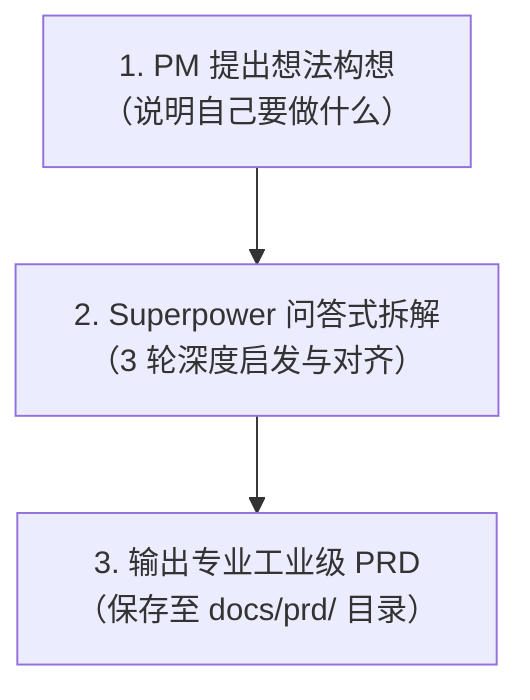

# 🚀 产品经理 Superpower 需求工作流 (PM Superpower Workflow)

专为**产品经理（Product Manager）**量身打造的端到端需求孵化工作流。

---

## 💡 工作流核心理念

许多产品设计与研发返工的根源在于：**在需求未对齐、边界未敲定时过早进入方案与代码实现**。

本工作流集成 **Superpower 启发式问答与拆解方法论**：
- **不急于下结论**：通过苏格拉底式反问拆解业务核心意图；
- **分轮收敛**：从“目标边界”到“核心旅程”，再到“异常与边缘情况”；
- **标准产出**：输出研发可直接评审、测试可直接设计用例的高质量 PRD 文档。

---

## 🛠 工作流三步法



### 1. 阶段一：构想输入 (Idea Ingestion)
产品经理只需用日常语言描述自己的初始需求。例如：
> “我想做一个面向客服团队的智能工单自动分类与工单流转系统。”
> “我们需要为商户后台增加一个批量导出销售报表的功能。”

### 2. 阶段二：Superpower 问答式需求拆解 (Socratic Deconstruction)
AI 将扮演**资深产品架构师 / 顾问**，分 3 轮展开启发式深度对齐：
- **第 1 轮（价值与边界）**：深挖为什么要做、谁来使用、MVP 目标指标，以及**本次坚决不做什么（Non-Goals）**。
- **第 2 轮（场景与旅程）**：端到端主流程梳理、关键用户动线、实体状态机流转。
- **第 3 轮（规则与异常）**：业务校验与计算规则、弱网/并发/超时/逆向回退等边缘异常用例处理。

*提示：每轮仅提 2~3 个问题，并提供参考选项，产品经理无需长篇大论，选择或补充即可。*

### 3. 阶段三：规范化 PRD 输出 (PRD Generation)
对齐完成后，系统将自动在 `docs/prd/` 目录下生成完整的 Markdown 需求文档，涵盖：
- 背景痛点与业务指标 (North Star / OKRs)
- 用户角色与权限矩阵
- 业务流程图与状态机图 (Mermaid 语法支持)
- 详细功能清单 (P0 / P1 / P2 优先级)
- 逐个功能点的交互、规则与 Edge Cases
- 非功能性需求 (性能、可用性、安全合规)
- 数据埋点与运营监控指标
- 实施里程碑计划

---

## 📁 目录结构

```text
history-pro-org/
├── .agents/
│   └── skills/
│       └── pm-superpower-prd/
│           ├── SKILL.md                          # 工作流核心执行技能定义
│           ├── templates/
│           │   └── prd-template.md               # 工业级标准 PRD 模板
│           └── references/
│               └── superpower-framework.md       # Superpower 苏格拉底式提问参考指南
├── docs/
│   └── prd/                                      # PRD 文档沉淀目录
├── GEMINI.md                                     # 智能体全局工作流触发规则
└── README.md                                     # 本使用说明
```

---

## 🏁 如何开始？

随时在对话框输入您的产品构想，例如：
> **“我想做一个[您的产品/功能名称]，主要用于解决[什么问题]。”**

工作流将立即自动启动，为您开启深度需求拆解！
