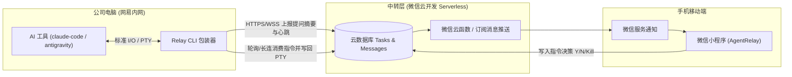
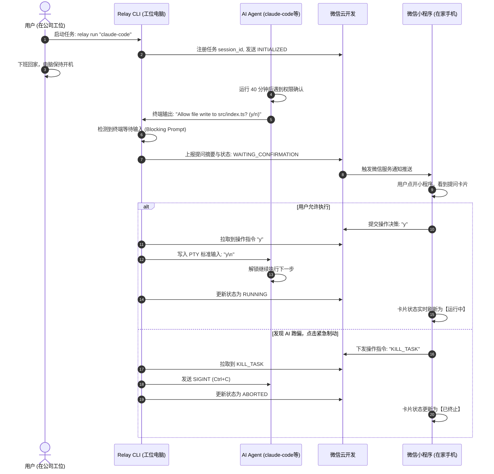
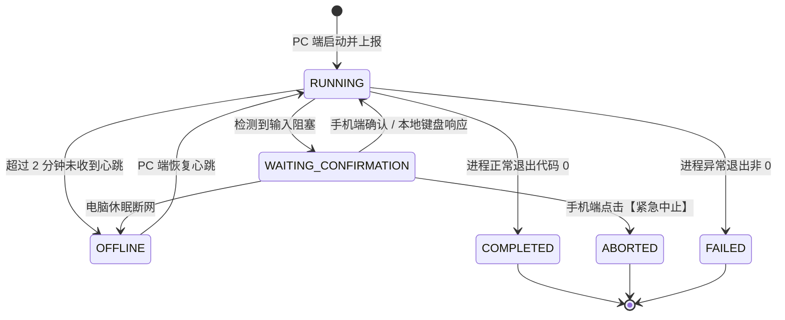

# 【产品需求文档】AgentRelay 远程 AI 任务伴侣 (PRD)

| 文档版本 | 文档状态 | 编写人 | 创建日期 | 评审状态 |
| :--- | :--- | :--- | :--- | :--- |
| V1.0.0 (MVP) | Ready for Review | 产品经理 | 2026-10-08 | 待评审 |

---

## 1. 需求背景与业务价值

### 1.1 业务背景与问题痛点
- **现状背景**：
  研发人员与产品经理在公司工位电脑（企业内网环境）使用新一代自主型 AI 编程工具（如 `claude-code`、`antigravity`、`deepseek harness` 等）处理复杂长耗时任务。这些任务往往需要执行数十分钟乃至数小时。
- **核心痛点**：
  1. **肉身绑定在工位**：下班后不便携带公司电脑回家，但长任务在执行过程中经常出现**需要人工确认的分支**（例如：文件修改审批 `[y/n]`、单选题确认、命令行执行授权等）。
  2. **任务卡死，效率中断**：一旦 AI 卡在确认环节，整个长任务进程就会一直阻塞挂起，导致晚间数小时宝贵的计算与执行时间浪费；等到第二天早晨上班才能手动确认，严重拖慢迭代节奏。
  3. **内网隔离阻碍远程访问**：工位电脑处于内网防火墙保护下，没有公网 IP，传统的 TeamViewer、向日葵等重度远程桌面工具在手机端操作体验极差，且受到公司安全网络策略限制。

### 1.2 业务目标与价值衡量 (Success Metrics)
- **核心目标**：
  构建一套**轻量、免运维、安全合规**的内网到移动端的中继伴侣系统，实现“人在家中，手机秒级确认，工位任务夜间不间断流转”。
- **成功指标 (North Star Metric)**：
  - **任务阻断恢复平均耗时 (MTTR)**：从原先的平均 8~12 小时（次日上班处理）降低至 3 分钟以内（手机收到通知后随手一按）。
  - **离线夜间任务成功跑通率**：长耗时任务夜间顺利执行完毕的比例由 < 20% 提升至 85% 以上。

---

## 2. 产品定位与演进规划

### 2.1 整体产品定位
- **MVP 阶段（当前）**：个人私有极简工具，聚焦“微信小程序 + PC CLI 包装器 + 微信云开发”，零服务器维护成本，开箱即用。
- **V2.0 阶段（预留架构设计）**：团队与部门级协作平台，支持企业微信/内部账号登录，支持部门资源配额、团队多机器状态看板与审计日志。

### 2.2 用户角色与权限体系

| 角色 | 权限范围 | 典型场景 |
| :--- | :--- | :--- |
| **设备所有者 (Owner / PM / Dev)** | 绑定个人设备，查看本人名下任务列表，接收阻断推送，执行远程确认/紧急中止 | 下班后在家中通过手机查看并推进公司电脑任务 |
| **系统管理员 (Admin - 规划中)** | 团队成员管理、内网接入节点列表查看、操作审计日志导出 | 部门主管查看资源使用情况与数据流转合规性 |

---

## 3. 需求范围与边界划分 (In-Scope vs Non-Goals)

### 3.1 本期包含范围 (MVP In-Scope)
- [x] **PC 端轻量终端包装器 (CLI Wrapper)**：支持通过 `relay run <command>` 启动任意 AI 工具，监听 PTY 输入输出流。
- [x] **阻断与交互式提问捕获**：自动识别 AI 处于“等待用户输入”状态（如 `?`、`[y/n]`、选择菜单）。
- [x] **数据合规脱敏中继**：仅上传提问摘要及最近 10 行上下文，严禁上传整个项目源码。
- [x] **微信云开发 (Serverless) 中转**：利用微信云开发数据库与云函数中转消息，免购公网 VPS、免域名备案。
- [x] **手机端任务卡片与一键决策**：手机端展示提问卡片，支持一键发送 `Y`、`N`、选项编号或单行文本回复。
- [x] **远程紧急制动 (Kill Task)**：手机端一键向 PC 下发 `SIGINT / Ctrl+C` 强制刹车，防止死循环。
- [x] **双向输入共存**：手机端和电脑本地键盘均可响应输入，次日到工位可无缝接管。
- [x] **心跳监控与离线告警**：PC 端 30 秒上报一次心跳，2 分钟丢失触发离线提示。

### 3.2 明确不做的范围 (Non-Goals - MVP)
- ❌ **不做全量终端字符流远程渲染 (No full PTY Web-Terminal)**：不把手机当成完整 Shell 终端，避免网络流量浪费及复杂字符渲染问题。
- ❌ **不做远程复杂代码编辑器与 Diff 审查**：手机端仅做“确认/放行/拒绝”，深度代码修改留在 PC 本地进行。
- ❌ **不做移动端复杂任务从零发起**：本期仅针对“在工位已启动、下班后保持运行”的长任务做中继，不提供手机端写长 Prompt 初始立项。

---

## 4. 系统架构与业务全景

### 4.1 系统整体交互架构


### 4.2 端到端业务时序图 (Socratic Sequence Flow)


### 4.3 任务状态机流转 (State Machine)


---

## 5. 功能需求详细说明 (Feature Breakdown)

### 模块一：PC 端终端包装器 (Relay CLI)

#### 功能点 F-01：任务托管启动与会话配对（优先级：P0）
1. **命令格式**：
   ```bash
   relay run "<target_command>"
   # 示例：relay run "claude-code"
   # 示例：relay run "antigravity"
   ```
2. **鉴权与配对逻辑**：
   - 首次运行生成本地配置文件 `~/.agentrelay/config.json`，内含 `deviceId` 与 `userToken`。
   - 终端打印小程序绑定二维码或 6 位动态配对码，手机端扫码/输入即可绑定设备。
   - 数据实体预留 `tenant_id` 与 `user_id`，以支持未来团队多租户平滑升级。
3. **PTY 管道接管**：
   - 使用跨平台虚拟终端库（如 `creack/pty` 或 `node-pty`）挂载目标命令，完整保留本地终端原有的彩色字符、光标及键盘交互能力。

#### 功能点 F-02：阻断提问检测与数据脱敏上报（优先级：P0）
1. **等待状态判定机制**：
   - **时间静止检测**：终端标准输出在 1.5 秒内无新增字符，且光标处于输入行。
   - **关键词特征库匹配**：正则匹配常见 Prompt 特征，如 `(?i)\(y\/n\)|\?|>|Please confirm|Choice:`。
2. **数据脱敏规则 (合规保障)**：
   - 仅截取包含 Prompt 的**最近 10 行文本**作为上下文摘要（Summary）。
   - 严禁遍历或读取当前工作区源码文件。
   - 文本上报前过滤敏感 Token（如 `ghp_*`、`sk-*` 等密码及内网凭据）。
3. **上报载荷格式 (Payload)**：
   ```json
   {
     "session_id": "sess_20261008_xxx",
     "device_id": "dev_mac_workstation_01",
     "status": "WAITING_CONFIRMATION",
     "prompt_text": "Apply changes to auth.service.ts? [Y/n]",
     "recent_logs": [
       "Running linter...",
       "Detected 1 warning.",
       "Apply changes to auth.service.ts? [Y/n]"
     ],
     "suggested_actions": ["Y", "N"],
     "timestamp": 1791442000
   }
   ```

#### 功能点 F-03：心跳机制与指令消费执行（优先级：P0）
1. **心跳维持**：
   - CLI 每隔 30 秒向云端数据库更新一次 `last_heartbeat_time`。
2. **指令消费 (Downlink Action)**：
   - 处于 `WAITING_CONFIRMATION` 状态时，CLI 开启 1 秒高频轮询（或长连接监听），拉取用户在手机端提交的 `action`。
   - 收到单行文本（如 `y`）：CLI 向 PTY 注入 `y\n`，唤醒 AI 工具。
   - 收到 `KILL_TASK`：CLI 向子进程发送 `SIGINT` (等效于 Ctrl+C)，如 5 秒未退出则发送 `SIGTERM`。
3. **本地键盘并行解挂**：
   - 若用户第二天早晨直接在公司电脑键盘按下按键，CLI 检测到本地键盘输入后，自动将状态更新回 `RUNNING`，并将云端该提问标记为【已在本地处理】。

---

### 模块二：移动端微信小程序 (AgentRelay Mini Program)

#### 功能点 F-04：任务看板与状态列表（优先级：P0）
1. **页面布局**：
   - **头部**：当前绑定设备状态标签（【在线】绿灯 / 【离线】灰灯）、最后心跳时间。
   - **主体**：当前正在运行的任务卡片（包含任务名称、已运行时长、当前状态徽标）。
   - **状态颜色区隔**：
     - `RUNNING`：动态旋转蓝色指示器，显示“执行中”。
     - `WAITING_CONFIRMATION`：高亮黄色警示，置顶并震动提示“等待确认”。
     - `OFFLINE`：灰色，提示“电脑可能已休眠或断网”。
     - `COMPLETED`：绿色，“已完成”。

#### 功能点 F-05：阻断提问卡片与一键交互决策（优先级：P0）
1. **卡片信息呈现**：
   - 提问核心内容大字号展示（例如：“是否允许写入文件 `src/index.ts`？”）。
   - 折叠面板：点击可展开查看最近 10 行上下文日志（等宽代码字体显示）。
2. **交互动作区 (Action Bar)**：
   - **快捷预置按钮**：若系统分析出 `[Y/n]`，直接提供大尺寸按键【同意 (Y)】、【拒绝 (N)】。
   - **自定义输入框**：支持点击弹出单行输入键盘，输入数字序号（如 `1`、`2`）或简短回复后点击发送。
   - **紧急中止按钮**：右上方醒目弱化红色按钮【终止任务】，点击弹出二次防误触确认框：“确定要在工位电脑强制中止此任务吗？”，确认后发送 `KILL_TASK`。
3. **提交反馈**：
   - 点击确认后按钮显示 Loading，收到云端成功回执后震动反馈，卡片平滑折叠，状态刷新为【运行中】。

#### 功能点 F-06：微信服务通知与推送拦截（优先级：P1）
1. **订阅消息机制**：
   - 用户在打开小程序时授权“任务卡住提醒”与“任务完成提醒”订阅消息。
2. **推送文案规范**：
   - **标题**：AI 任务等待确认提醒
   - **任务名称**：claude-code (工位主机)
   - **卡住内容**：Allow file write to src/index.ts? [Y/n]
   - **时间**：2026-10-08 21:15:30
   - **跳转逻辑**：点击服务通知卡片，直接调起小程序对应任务详情页。

---

## 6. 非功能性需求 (NFR)

### 6.1 安全与内网合规 (Security & Compliance)
1. **最小数据暴露原则**：严禁向云端中继数据库写入源代码全量文本。仅允许传输提问行及最多 10 行脱敏后的前后日志。
2. **传输加密**：PC 客户端与微信云开发之间全链路强制走 TLS 1.3 HTTPS 通信。
3. **身份鉴权**：每台 PC 在配对时生成高强度随机 Token，小程序端查询请求必须校验 openid 与设备绑定关系的有效性。

### 6.2 性能与实时性 (Performance)
1. **端到端指令时延**：手机端点击确认后，工位电脑响应注入的平均时延 <= 1.5 秒。
2. **资源占用**：PC 端 Relay CLI 常驻内存占用 <= 35MB，CPU 占用率 <= 0.5%，绝不抢占编译与大模型推理资源。

### 6.3 稳定性与容灾 (Reliability)
1. **网络重试与自动重连**：内网网络偶发性闪断时，CLI 内置指数退避重连机制，网络恢复后 5 秒内自动重新注册。
2. **PC 休眠防死锁**：若电脑休眠导致任务挂起，手机端明确显示“电脑离线”，禁止发送无效的确认指令，避免产生状态不一致脏数据。

---

## 7. 数据结构设计 (Data Schema)

### 7.1 任务会话表 (`relay_tasks`)
```json
{
  "_id": "task_uuid_1001",
  "tenant_id": "tenant_default",
  "user_id": "user_openid_xxx",
  "device_id": "dev_workstation_net_ease",
  "command": "claude-code",
  "status": "WAITING_CONFIRMATION", // RUNNING | WAITING_CONFIRMATION | COMPLETED | FAILED | ABORTED | OFFLINE
  "prompt_data": {
    "question": "Allow file write to src/index.ts? (y/n)",
    "recent_logs": ["build success", "running test", "..."],
    "options": ["y", "n"]
  },
  "created_at": 1791440000,
  "updated_at": 1791442000,
  "last_heartbeat": 1791442020
}
```

### 7.2 指令回传表 (`relay_commands`)
```json
{
  "_id": "cmd_uuid_2001",
  "task_id": "task_uuid_1001",
  "action_type": "INPUT", // INPUT | KILL_TASK
  "payload": "y",
  "status": "PENDING", // PENDING | CONSUMED | EXPIRED
  "created_at": 1791442035,
  "consumed_at": 1791442036
}
```

---

## 8. 实施计划与里程碑 (Roadmap)

| 阶段 | 交付物 | 核心验证指标 | 周期估算 |
| :--- | :--- | :--- | :--- |
| **Phase 1: CLI 原型与 PTY 拦截** | PC 端 `relay` CLI 原型，可包装执行命令并捕获交互式 `[y/n]` | 在本地成功拦截 `claude-code` 提问并模拟回车 | 3 天 |
| **Phase 2: 微信云开发通道打通** | 云函数、云数据库与订阅消息配置，CLI 实现上报与消费 | CLI 与云端实现 1 秒内双向消息通信 | 2 天 |
| **Phase 3: 小程序端 UI 与交互开发** | 微信小程序界面上线，实现设备绑定、卡片决策、紧急中止 | 手机端点击按钮，工位电脑即刻自动写入 | 3 天 |
| **Phase 4: 内网环境实测与打磨** | 在网易工位内网电脑进行真实跨夜长任务连通性压测 | 验证网络闪断恢复、连续 3 次长任务夜间无故障跑通 | 2 天 |
| **Phase 5: 正式投产使用** | 产出快速安装指南与自托管配置脚本 | 个人日常稳定使用 | 1 天 |

---

## 9. 风险评估与应对策略 (Risk & Mitigations)

| 潜在风险项 | 风险等级 | 应对策略 |
| :--- | :--- | :--- |
| **公司电脑节能策略触发自动休眠** | 高 | 在启动文档中推荐开启“接通电源时禁止睡眠”设置，或在 CLI 中集成休眠唤醒锁 (Sleep Blocker) 防止锁屏休眠 |
| **AI 工具输出 Prompt 格式不规律导致漏检** | 中 | 采用“输出静止计时 + 常见正则匹配”双重保险；小程序端允许用户无论是否检测到 Prompt，均可主动下发文本输入 |
| **微信订阅消息次数限制** | 中 | 引导用户在小程序每次进入时勾选“总是保持此类通知”，或在小程序内集成前台轮询刷新 |
