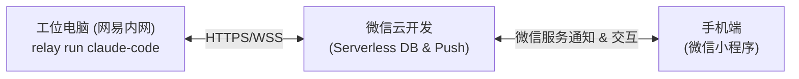

# 🚀 AgentRelay - 远程 AI 任务伴侣

> 解决在网易内网工位电脑运行 `claude-code`、`antigravity`、`deepseek harness` 等长耗时任务时，下班后在家通过微信小程序随时查看进度、接收卡住提问、一键确认/紧急中止的轻量中继工具。

---

## 📌 项目核心亮点

- **零服务器运维**：采用微信云开发 (Serverless / CloudBase)，无需自购云主机、免域名备案与繁琐运维。
- **免侵入接入**：PC 端提供极简命令行包装器 `relay run "<command>"`，无感接管终端输入输出。
- **安全合规无忧**：严格遵守内网安全红线，仅上传当前卡住的提问摘要（最近 10 行），绝不上传源码。
- **双向协同无锁**：手机端一键确认；第二天上班直接敲本地键盘同样能够无缝接管任务。
- **安全制动**：提供手机端【紧急中止 (Kill Task)】按钮，避免死循环或高危误操作。

---

## 📁 项目文档导航

- [产品需求文档 (PRD)](./docs/prd/PRD-AgentRelay-远程AI任务伴侣.md)：完整三轮 Superpower 对齐产出的工业级 PRD。
- 技术方案 (TRD)：*（待编写）*
- 源代码目录：`src/`

---

## 🗺️ 架构草图

