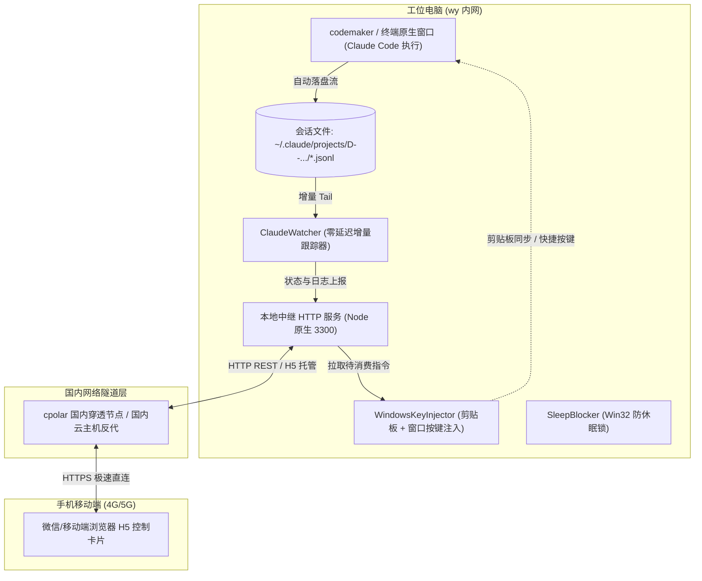
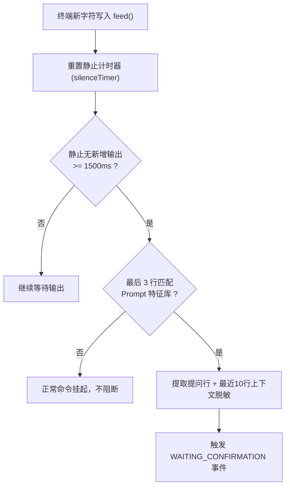

# 【技术方案设计】AgentRelay 远程 AI 任务伴侣 (TRD)

| 文档版本 | 文档状态 | 编写人 | 评审日期 | 关联 PRD |
| :--- | :--- | :--- | :--- | :--- |
| V1.0.0 (MVP) | Ready for Review | 架构与研发团队 | 2026-10-08 | [PRD-AgentRelay-远程AI任务伴侣.md](../prd/PRD-AgentRelay-远程AI任务伴侣.md) |

---

## 1. 架构总览与设计目标

### 1.1 系统上下文与目标
- **业务诉求**：承接 PRD 需求，在工位电脑（wy 内网环境）托管执行 `claude-code`、`antigravity`、`deepseek harness` 等长耗时 AI Agent 任务；当任务陷入用户交互阻断时，捕获提问并脱敏中继至微信小程序，支持手机端一键确认或紧急制动。
- **技术核心指标**：
  - **端到端同步时延**：手机端决策提交后，本地终端在 1.5 秒内响应注入。
  - **极低资源开销**：CLI 常驻内存 <= 30MB，CPU 占用率 <= 0.5%。
  - **零云端维护**：基于微信云开发 (Serverless / CloudBase)，免自建公网 VPS、免域名备案与免搭 Nginx。
  - **内网安全合规**：严禁上传项目源码，仅脱敏上传 Prompt 及最近 10 行交互文本。

### 1.2 系统架构拓扑图


---

## 2. 领域模型与数据契约 (Data Contracts)

### 2.1 任务会话实体 (`RelayTask`)
```typescript
export interface RelayTask {
  _id: string;                    // 任务全局唯一ID (如: task_1791440000_abcd)
  tenant_id: string;              // 租户ID (MVP阶段固定为 'tenant_default', 预留部门级扩展)
  user_id: string;                // 用户 openid 或用户标识
  device_id: string;              // 工位电脑设备唯一指纹
  command: string;                // 执行的启动命令 (如: 'claude-code')
  status: TaskStatus;             // 任务状态机枚举
  prompt_data?: PromptPayload;    // 阻断时的提问与上下文脱敏摘要
  created_at: number;             // 创建时间戳 (ms)
  updated_at: number;             // 更新时间戳 (ms)
  last_heartbeat: number;         // 最新心跳时间戳 (ms)
}

export type TaskStatus = 
  | 'INITIALIZING'          // 初始化中
  | 'RUNNING'               // 正常执行中
  | 'WAITING_CONFIRMATION'  // 等待手机端/本地人工确认
  | 'COMPLETED'             // 执行完毕 (退出码 0)
  | 'FAILED'                // 异常失败 (退出码非 0)
  | 'ABORTED'               // 被远程紧急制动中止
  | 'OFFLINE';              // 超过 2 分钟无心跳视为离线
```

### 2.2 阻断提问载荷 (`PromptPayload`)
```typescript
export interface PromptPayload {
  question: string;               // 核心提问内容 (如: "Allow file write to src/index.ts? [Y/n]")
  recent_logs: string[];          // 最近 10 行上下文日志 (脱敏后)
  suggested_options: string[];    // 智能提取出的快捷按键 (如: ["Y", "N"])
  triggered_at: number;           // 触发阻断时间戳 (ms)
}
```

### 2.3 指令回传实体 (`RelayCommand`)
```typescript
export interface RelayCommand {
  _id: string;                    // 指令唯一ID
  task_id: string;                // 关联任务 ID
  command_type: 'INPUT' | 'KILL'; // 指令类型: 键盘输入 或 紧急刹车
  payload?: string;               // 输入内容 (如: 'y', 'n', '1')
  status: 'PENDING' | 'CONSUMED'; // 消费状态
  created_at: number;             // 下发时间戳
  consumed_at?: number;           // 消费时间戳
}
```

---

## 3. 核心接口签名契约 (Interface Signature Contracts)

遵循开发工作流**“接口先行”**与**“上下文隔离”**原则，明确定义核心组件契约：

### 3.1 Prompt 阻断检测器契约 (`IPromptDetector`)
负责分析标准终端输出流，判断终端是否进入交互阻塞等待状态。

```typescript
export interface IPromptDetector {
  /**
   * 追加接收到的一段终端流数据
   * @param chunk 终端原始输出字符串 (含 ANSI 转义符)
   */
  feed(chunk: string): void;

  /**
   * 检查当前缓冲区是否已满足阻断停顿判定
   * 判定规则: 
   * 1. 最近数据流静止持续时间 >= silenceThresholdMs (默认 1500ms)
   * 2. 末尾包含 Prompt 关键词特征正则匹配
   * @returns 阻断信息或 null
   */
  checkSilence(): PromptPayload | null;

  /**
   * 重置当前检测缓冲区 (用户输入继续后调用)
   */
  reset(): void;

  /**
   * 清洗 ANSI 转义控制字符 (去除终端色彩控制码)
   * @param raw 原始字符串
   */
  stripAnsi(raw: string): string;
}
```

### 3.2 PTY 终端管理器契约 (`ITerminalManager`)
负责跨平台挂载子进程、双向透传输入输出。

### 3.2 会话监听器契约 (`IClaudeWatcher`)
负责零侵入监听目标项目的 Claude Code 增量会话文件（JSONL）流。

```typescript
export interface IClaudeWatcher {
  /** 启动观察器并监听增量记录 */
  start(intervalMs?: number): this;
  /** 停止观察器 */
  stop(): void;
  /** 事件：实时消息产生 */
  on(event: 'message', listener: (msg: { role: string; text: string; timestamp: string }) => void): this;
  /** 事件：触发人工裁决/确认关卡 */
  on(event: 'prompt', listener: (prompt: { question: string; fullText: string; timestamp: string }) => void): this;
}
```

### 3.3 剪贴板与按键注入器契约 (`IKeyInjector`)
负责将手机端裁决决策无损回传至 Windows 目标窗口。

```typescript
export interface IKeyInjector {
  /**
   * 将文本同步写入系统剪贴板并向目标窗口注入
   * @param text 要发送的内容 (如 "确认")
   * @param windowTitle 目标窗口标题模糊匹配
   */
  sendKeys(text: string, windowTitle?: string): Promise<boolean>;
}
```

### 3.3 云端同步客户端契约 (`ICloudSyncClient`)
负责内网 PC 与微信云开发数据库的双向通道。

```typescript
export interface ICloudSyncClient {
  /**
   * 注册任务会话并开启心跳
   */
  registerTask(taskId: string, command: string): Promise<boolean>;

  /**
   * 上报阻断提问与状态切换
   */
  reportPrompt(taskId: string, payload: PromptPayload): Promise<boolean>;

  /**
   * 恢复为 RUNNING 状态
   */
  resumeTask(taskId: string): Promise<boolean>;

  /**
   * 轮询拉取未消费的操作指令 (长轮询或 1s 间隔)
   */
  pollCommand(taskId: string): Promise<RelayCommand | null>;

  /**
   * 标记指令已被消费
   */
  ackCommand(commandId: string): Promise<boolean>;

  /**
   * 上报任务结束
   */
  finishTask(taskId: string, exitCode: number): Promise<boolean>;
}
```

---

## 4. 关键算法与机制设计

### 4.1 终端静止与 Prompt 正则双重判定机制


- **特征正则库**：
  ```javascript
  const PROMPT_PATTERNS = [
    /\((y\/n|yes\/no)\)/i,
    /\[(y\/n|yes\/no)\]/i,
    /\?\s*$/m,
    /(please enter|choice|select an option|confirm.*:)\s*$/i,
    />\s*$/m
  ];
  ```

### 4.2 本地键盘与手机端双向竞争解决
- 当 PC 检测到本地键盘有按键输入时，立即本地注入 PTY 并将云端任务状态从 `WAITING_CONFIRMATION` 置回 `RUNNING`。
- 若手机端在此时也提交了 `y`，云端通过状态 CAS 乐观锁判断当前任务已不在 `WAITING_CONFIRMATION`，直接判定指令过期 (`EXPIRED`)，避免重复提交冲突。

---

## 5. 安全合规与内网防泄漏机制

1. **脱敏过滤管道 (Desensitization Pipeline)**：
   - 提取最近 10 行时，执行脱敏正则，替换邮箱、密钥（`sk-[a-zA-Z0-9]{20,}`）、内网 IP 与主机名为 `[REDACTED]`。
2. **零源码接触**：
   - CLI 仅作为一个标准 I/O 管道，完全不读取本地文件系统中的业务源码。
