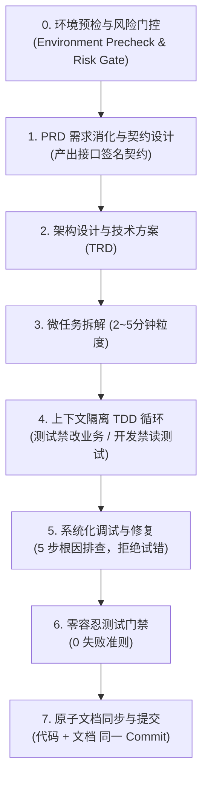

# 💻 开发工作流 (Development Workflow)

本目录沉淀面向**工程师与技术架构师**的标准化技术方案设计、任务拆解、上下文隔离与测试驱动开发 (TDD) 工程化规范。

吸收并融合了先进的工程纪律：**环境预检、风险门控、接口签名契约先行、测试零容忍门控与原子文档同步**。

---

## 📌 核心工作流：Superpower 7 步工程闭环

在 PRD 评审完毕后，严禁未经设计直接编写业务代码，必须严格执行工程闭环：

---

## 🛡️ 核心工程铁律一览

### 1. 接口签名契约先行与上下文隔离
- 需求/架构设计阶段首先产出**接口签名契约**（方法名、入参、出参、异常）。
- **隔离规则**：开发人员（Code-Dev）**严禁偷读测试实现代码**；测试人员（TDD）**严禁修改业务实现代码**。防止对着测试抄答案或改弱测试掩盖缺陷。

### 2. 零容忍测试门禁 (0 Failures)
- **0 失败 = 通过，>0 失败 = 不通过，绝无例外**。严禁以“非本次引入”为由容忍测试报错，杜绝破窗效应。

### 3. 代码变更后原子文档同步 (Atomic Doc-Sync)
- **文档同步与 `git commit` 是同一个原子动作，不是两个独立步骤**。
- 凡引入新模块、改接口契约、改数据模型或改业务行为，必须与代码在**同一个 commit** 中提交。

### 4. 系统化调试 (Systematic Debugging)
- 遇 Bug 严禁盲目打补丁，按 `复现 ➡️ 至少 2 个假设 ➡️ 最小实验 ➡️ 定位根因 ➡️ 编写回归测试修复` 标准推进。

---

## 📁 规范与模板导航

- [环境预检工作流规范 (environment-precheck.md)](./environment-precheck.md)：开工前五维环境检查。
- [风险门控工作流规范 (risk-gate.md)](./risk-gate.md)：高/中/低风险分类与破坏性操作降级策略。
- [原子文档同步检查清单 (doc-sync.md)](./doc-sync.md)：Commit 前强制四项文档同步检查。
- [技术方案设计 (TRD) 模板 (templates/trd-template.md)](./templates/trd-template.md)：工业级架构与接口设计模板。
- [任务拆解与测试计划模板 (templates/task-breakdown-template.md)](./templates/task-breakdown-template.md)：微任务拆解清单。
- [开发工作流最佳实践参考 (references/dev-best-practices.md)](./references/dev-best-practices.md)：完整工程规约与机制详解。
