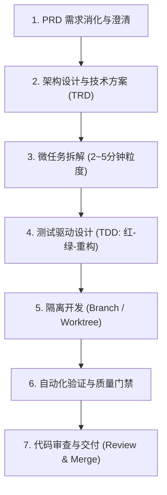

# 💻 开发工作流 (Development Workflow)

本目录沉淀面向**工程师与技术架构师**的标准化技术方案设计、任务拆解与测试驱动开发 (TDD) 工程化规范。

---

## 📌 核心工作流：Superpower 7 步工程化闭环

在 PRD 评审完毕后，严禁未经设计直接编写业务代码，必须严格执行 7 步工程闭环：

### 关键阶段说明

1. **技术方案设计 (TRD)**：
   - 梳理领域模型、数据表结构、API 协议契约、时序交互与异常容灾方案。
   - 模板参考：[templates/trd-template.md](./templates/trd-template.md)。
2. **微任务拆解 (Task Breakdown)**：
   - 将大功能拆解为单个 2~5 分钟即可完成的原子任务（Micro-tasks）。
   - 每个任务明确定义：前置依赖、改动文件范围、验证命令。
   - 模板参考：[templates/task-breakdown-template.md](./templates/task-breakdown-template.md)。
3. **TDD 测试驱动开发**：
   - 先写失败的测试用例（Red） ➡️ 编写刚好通过的代码（Green） ➡️ 重构优化（Refactor）。
4. **质量门禁与安全合规**：
   - 静态语法检查、Lint 规范、内网数据脱敏审查、单元测试覆盖率门禁（核心逻辑 >= 80%）。

---

## 📁 目录结构

- [templates/trd-template.md](./templates/trd-template.md)：技术方案设计 (TRD) 标准模板。
- [templates/task-breakdown-template.md](./templates/task-breakdown-template.md)：工程任务拆解与实施计划模板。
- [references/dev-best-practices.md](./references/dev-best-practices.md)：Superpower 敏捷开发最佳实践与规范。
