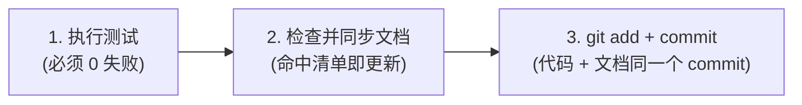

# 代码变更后文档同步规范 (Atomic Doc-Sync)

> ⚠️ **核心铁律**：**文档同步与 `git commit` 是同一个原子动作，绝对不是前后两个独立步骤！**
> 严禁“先提交代码，后续再补文档”的两次提交模式。历史多次教训证明，事后补文档必然导致遗漏或失真。

---

## 一、提交前强制四项检查清单

准备执行 `git commit` 前，按以下顺序检查，**凡是命中一项为「是」，必须连同更新文档一起提交**：

| 检查项 | 若为「是」→ 必须同步的目标文档 |
| :--- | :--- |
| **1. 引入了新类 / 新模块 / 新可执行文件？** | 更新项目 `docs/trd/` 对应技术文档，并在架构总览中追加说明 |
| **2. 修改了接口契约、数据模型或 SQL 表结构？** | 更新 API 契约文档（OpenAPI/Markdown）与数据字典/DDL 迁移脚本 |
| **3. 改变了某个功能的外部行为或业务边界？** | 更新项目测试用例集 (Test Specs)，必要时同步反哺 PRD |
| **4. 属于独立功能迭代，或 Bug 修复升级为方案变更？** | 更新实施任务计划表，并在设计方案中补齐 Architecture Decision Record (ADR) |

---

## 二、提交标准化执行序列

在任何代码准备提交时，严格执行以下 3 步闭环：

1. **Step 1: 运行全量测试**：必须确保测试 0 失败。
2. **Step 2: 执行文档同步**：对照上方四项清单，同步修改对应的 Markdown / Schema / 契约文件。
3. **Step 3: 原子提交**：`git add <代码文件> <文档文件>` ➡️ `git commit -m "..."`。
