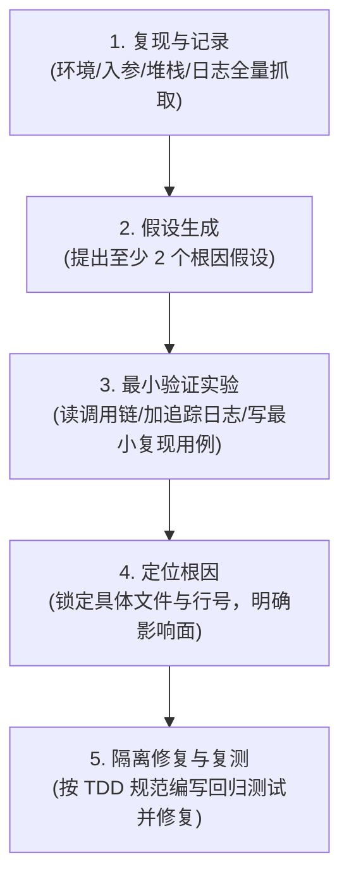

# 研发工作流最佳实践与工程规约 (Engineering Best Practices)

本规范融合 Superpower 7 步工程闭环与实战 Agent 严密协作机制，建立兼具敏捷与军工级严谨度的研发标准。

---

## 🏛️ 一、接口先行与上下文隔离（核心铁律）

在协同开发（多角色/多智能体协作）过程中，最大的陷阱在于**开发者/编码模型偷看测试用例“抄答案”，为了过测试而硬编码，或在改业务代码时篡改测试掩盖缺陷**。

### 1. 接口签名契约先行 (Interface Contract First)
- 在编写任何实现代码前，必须先产出**接口签名契约**（方法名、参数类型、返回值、异常定义、前置/后置约束）。
- 该契约是开发团队与测试团队的唯一协同输入。

### 2. 严格上下文隔离矩阵 (Context Isolation)

| 协作角色 | 允许读取的内容 | 严禁读取 / 严禁写入 | 职责边界 |
| :--- | :--- | :--- | :--- |
| **设计角色 (Requirement/Design)** | PRD、TRD 架构文档、现有公共接口签名 | 严禁深入测试实现文件 | 产出接口签名契约与原子任务拆解 |
| **开发角色 (Code-Dev)** | PRD/TRD、接口签名契约、业务源码 | **严禁读取测试实现用例代码** (`*.test.*`, `*Test.*`) | 仅基于接口契约与验收标准实现业务逻辑 |
| **测试角色 (TDD/QA)** | 接口签名契约、测试用例集、业务接口定义（只读） | **严禁修改任何业务源码** | 编写失败测试、执行测试、定位未通过项 |
| **审查角色 (Review)** | 所有变更 Diff、PRD/TRD/Test 完整工程 | **只读审查，严禁写入任何文件** | 模块解耦、边界漏洞、安全合规独立把关 |

---

## 🛡️ 二、测试零容忍门控 (Zero-Tolerance Test Gate)

- **核心原则**：**0 失败 = 通过，>0 失败 = 不通过，绝无例外。**
- **严禁破窗效应**：严禁以“这个失败不是我本次引入的”为借口容忍既有失败用例。如果仓库存在旧失败，必须优先定位并修复，或者明确归因并拦截提交。
- **本地验证闭环**：代码提交前必须执行全量自动化测试，确保 100% 通过。

---

## 📝 三、原子文档同步机制 (Atomic Document Sync)

- **核心原则**：**文档与代码的同步必须在同一个 Git Commit 中完成**。
- **反模式警示**：历史教训表明，“先提代码、事后补文档”的失误率高达 100%，必然导致架构文档与实际代码脱节。
- **强制检查条件**（满足任意一项即触发文档同步）：
  1. 引入了新类、新模块、新依赖或新可执行文件；
  2. 修改了公开 API 接口签名、数据模型、字段或 SQL 表结构；
  3. 变更了既有业务逻辑的边界或交互行为；
  4. 属于方案架构升级或重大设计决策变更 (ADR)。

---

## 🔍 四、系统化调试五步法 (Systematic Debugging)

遇到测试失败、运行时异常或线上 Bug 时，**严禁盲目试错或随意打补丁**，必须严格执行五步排查：

1. **Step 1: 复现与记录**：明确在什么环境、何种输入及并发下出现，记录完整报错堆栈与日志上下文。
2. **Step 2: 假设生成**：基于现象，头脑风暴并提出**至少 2 个**可能的技术根因假设。
3. **Step 3: 最小验证实验**：通过调用链排查、添加关键断点/日志、编写针对该 Bug 的最小单元测试，逐一验证或推翻假设。
4. **Step 4: 定位根因**：锁定根因所在模块及具体行号，评估修改对上下游系统的副作用。
5. **Step 5: 隔离修复**：先确保复现测试稳定报红，再编写修复代码使之变绿，最后跑全量测试确保无回归破坏。

---

## ✅ 五、完成前三维交付验证清单 (Verify Gate)

在声称任务“已完成/已修复/可交付”前，必须提供以下三维证据支撑，不得凭主观臆断：

### 1. 代码证据
- [ ] 编译构建通过（0 警告、0 语法错误）
- [ ] 自动化测试全量通过（0 失败）
- [ ] 调试性代码已清理（无临时打印、无未决的 TODO 盲区）
- [ ] 无写死的内网敏感凭据与测试硬编码数据

### 2. 文档证据
- [ ] 对应技术设计方案 (TRD) 与接口契约已同步更新
- [ ] 关键业务流程时序图、数据字典已同步更新
- [ ] 测试用例规范文档已补充对应覆盖用例

### 3. Git 证据
- [ ] 代码与文档变更纳入同一个 Commit
- [ ] Commit 遵循 Conventional Commits 规范（`feat:`, `fix:`, `refactor:`, `test:`, `docs:`）
- [ ] 工作区干净无残留临时文件
