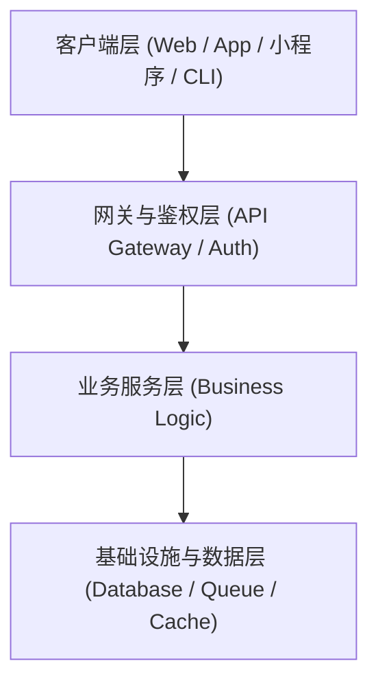
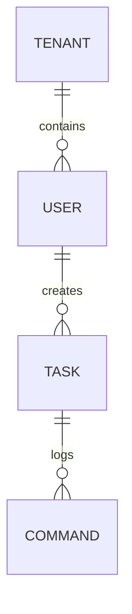
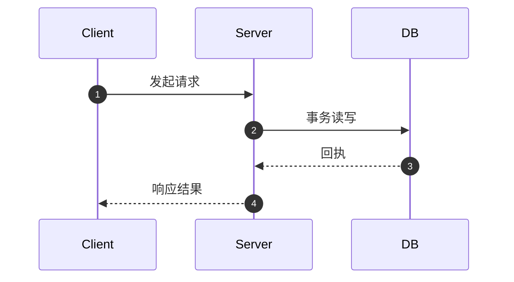

# 【技术方案设计】{{项目/功能模块名称}} (TRD)

| 文档版本 | 文档状态 | 编写人 | 评审日期 | 关联 PRD |
| :--- | :--- | :--- | :--- | :--- |
| V1.0.0 | Draft / Review / Approved | {{架构师/核心开发}} | {{YYYY-MM-DD}} | [PRD 链接](../prd/PRD-xxx.md) |

---

## 1. 架构总览与设计目标

### 1.1 系统上下文与目标
- **业务诉求**：简述本方案所承载的核心 PRD 业务场景。
- **技术目标**：高可用性、响应延时、高并发 TPS 目标、跨平台兼容性等。

### 1.2 架构全景图 (Architecture Overview)

---

## 2. 领域模型与数据架构 (Data Schema)

### 2.1 实体关系图 (ER Diagram)

### 2.2 数据表结构定义 (DDL / JSON Schema)
- 表 1：`tasks`
- 表 2：`commands`

---

## 3. 核心接口与协议规范 (API Contracts)

### 3.1 接口列表
| 接口名称 | 方法与路径 | 描述 | 调用方 |
| :--- | :--- | :--- | :--- |
| 注册任务会话 | `POST /api/v1/tasks` | CLI 启动时注册 Session | Relay CLI |
| 上报提问阻断 | `POST /api/v1/tasks/{id}/prompts` | 捕获到输入时上报 | Relay CLI |
| 下发决策指令 | `POST /api/v1/tasks/{id}/actions` | 手机端确认/中止 | 小程序 |

---

## 4. 关键技术方案与算法逻辑

### 4.1 核心流程时序图 (Sequence Flow)

### 4.2 难点与关键机制实现
- 机制 1：PTY 虚拟终端接管与 ANSI 转义字符清洗。
- 机制 2：防重放、幂等性 Token 与并发控制。

---

## 5. 异常处理与容灾降级 (Fault Tolerance)

| 故障场景 | 检测方式 | 恢复/降级策略 |
| :--- | :--- | :--- |
| 网络闪断 | 连接断开事件 / 探测超时 | 指数退避自动重连 (1s, 2s, 4s...) |
| 存储服务不可用 | API 返回 5xx | 写入本地持久化 SQLite/文件缓存 |
| 并发冲突 | 状态乐观锁版本号不一致 | 返回冲突错误并重新拉取最新状态 |

---

## 6. 部署架构与依赖环境

- **运行环境**：Node.js 20+ / Go 1.22+ / Python 3.11+
- **外部依赖服务**：微信云开发 / Redis / MySQL 等
