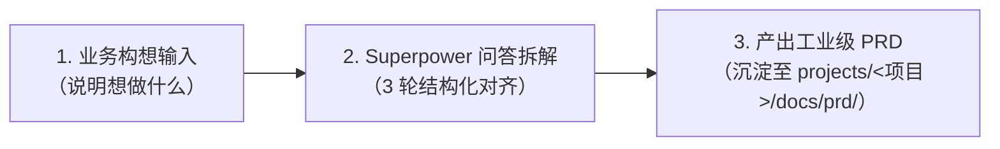

# 🎯 产品工作流 (Product Workflow)

本目录沉淀面向**产品经理 (PM)** 的标准化需求发现、启发式拆解与 PRD 产出规范。

---

## 📌 核心工作流：Superpower 需求启发与拆解

### 三轮问答拆解标准
1. **第 1 轮：价值与边界 (Why & Who & Non-Goals)**
   - 痛点定位、核心用户人群画像。
   - 商业与业务目标、核心成功指标 (North Star Metric)。
   - **MVP 范围 vs 明确不做 (Non-Goals)**。
2. **第 2 轮：场景与动线闭环 (Where & When & User Journey)**
   - 端到端核心主流程。
   - 业务实体生命周期与状态机 (State Machine)。
   - 核心角色权限与视窗边界。
3. **第 3 轮：业务规则、边界与异常 (How & Edge Cases & Trade-offs)**
   - 关键校验、运算与判定规则。
   - 极端与异常情况（弱网/并发/超时/逆向撤销/熔断）。
   - 上下游依赖与系统降级方案。

---

## 📁 目录结构

- [templates/prd-template.md](./templates/prd-template.md)：标准工业级产品需求文档 (PRD) 模板，内含 Mermaid 流程图与状态机规范。
- [references/superpower-framework.md](./references/superpower-framework.md)：Superpower 启发式问答哲学、苏格拉底提问清单与 6 维边缘异常矩阵。
